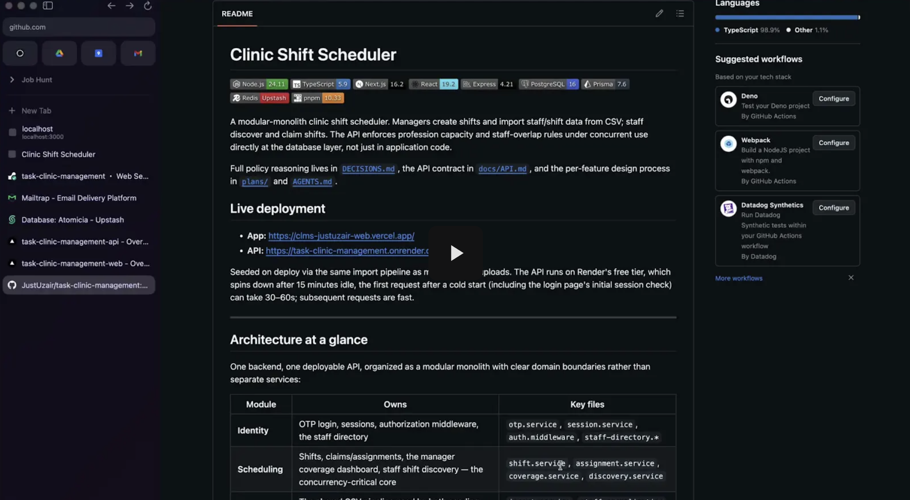

# Clinic Shift Scheduler


A modular-monolith clinic shift scheduler. Managers create shifts and import
staff/shift data from CSV; staff discover and claim shifts. The API enforces
profession capacity and staff-overlap rules under concurrent use directly at
the database layer, not just in application code.

Full policy reasoning lives in [`DECISIONS.md`](DECISIONS.md), the API
contract in [`docs/API.md`](docs/API.md), and the per-feature design process
in [`plans/`](plans/) and [`AGENTS.md`](AGENTS.md).

## Video demo

[](https://drive.google.com/file/d/1HwwvYJiAsMhNf2S546MRY5ifs7pAS_X0/view?usp=sharing)

## Live deployment

- **App:** https://clms-justuzair-web.vercel.app/
- **API:** https://task-clinic-management.onrender.com

Seeded on deploy via the same import pipeline as manager CSV uploads. The API
runs on Render's free tier, which spins down after 15 minutes idle, the
first request after a cold start (including the login page's initial session
check) can take 30–60s; subsequent requests are fast.

---

## Architecture at a glance

One backend, one deployable API, organized as a modular monolith with clear
domain boundaries rather than separate services:

| Module           | Owns                                                                                                              | Key files                                                                      |
| ---------------- | ----------------------------------------------------------------------------------------------------------------- | ------------------------------------------------------------------------------ |
| **Identity**     | OTP login, sessions, authorization middleware, the staff directory                                                | `otp.service`, `session.service`, `auth.middleware`, `staff-directory.*`       |
| **Scheduling**   | Shifts, claims/assignments, the manager coverage dashboard, staff shift discovery — the concurrency-critical core | `shift.service`, `assignment.service`, `coverage.service`, `discovery.service` |
| **Import**       | The shared CSV pipeline used by both seeding and manager uploads                                                  | `import.service`, `staff-normalization`, `shift-normalization`, `csv-parser`   |
| **Notification** | Durable, transactional in-app notifications with acknowledgement                                                  | `notification.service`                                                         |
| **Realtime**     | Server-Sent Events fan-out for live dashboard/schedule updates                                                    | `sse-hub`                                                                      |

PostgreSQL is the single source of truth for every domain rule — capacity,
overlap, and lifecycle checks are enforced in transactions and constraints,
not just in application code. Redis (Upstash) is scoped to OTP challenges and
rate limiting; it is never required for scheduling correctness. SSE is a
convenience layer — a client that misses an event simply refetches from
Postgres. The current Render deployment keeps the SSE connection open and
clients refetch authoritative state on reconnect or after a missed event.

---

## Directory structure

```
.
├── apps/
│   ├── api/                     # Express + TypeScript backend
│   │   ├── prisma/              # Schema and migrations
│   │   └── src/
│   │       ├── modules/         # identity, scheduling, import, notification, realtime
│   │       ├── config/          # env, database, redis, logger
│   │       ├── middleware/      # error handling, origin/CSRF guard
│   │       ├── bootstrap/       # migration + seed orchestration on startup
│   │       └── lib/             # shared errors, crypto helpers
│   └── web/                     # Next.js + MUI frontend
│       └── src/
│           ├── app/             # manager/ and staff/ routes
│           ├── components/      # dashboard, forms, import UI
│           └── features/        # API clients + hooks per domain
├── data/                        # Immutable staff.csv / shifts.csv fixtures
├── docs/API.md                  # Request/response and error-code contract
├── plans/                       # Per-decision design docs from the planning phase
├── DECISIONS.md                 # Accepted policies and tradeoffs
├── AGENTS.md                    # Source-of-truth hierarchy and invariants
├── docker-compose.yaml          # Runs the built API + web images
└── .env.example                 # Full environment contract
```

---

## Running it locally

**Requirements:** Docker with Compose, and accounts for Supabase, Upstash, and
Mailtrap (see below). Local development talks to the same hosted Postgres,
Redis, and email services as production — there's no local database
container — so an internet connection and real (free-tier) credentials are
required even for local dev.

```sh
cp .env.example .env   # then fill in every "replace-me" value
docker compose up --build
```

The web app runs at `http://localhost:3000`, the API at `http://localhost:4000`.
On first boot the API applies migrations, then imports `data/staff.csv` and
`data/shifts.csv` through the same pipeline used by manager uploads. Later
restarts skip already-completed seed checksums.

**Native development** (without Docker), after the same `.env` setup:

```sh
pnpm install
pnpm db:migrate
pnpm dev
```

**Docker development with live reload** is the standard local workflow. It
runs `next dev` for the frontend and uses Compose Watch to sync source changes
into the containers. Save a frontend file and let Next.js refresh the
browser—no rebuild or restart is needed.

```sh
docker compose up --watch
```

The first run builds the development images. Changes to `package.json` or
`pnpm-lock.yaml` rebuild the affected image automatically; source changes use
the frontend or API watch process. This requires Docker Compose 2.22 or newer.

---

## Environment variables and where to get them

Every variable is documented in `.env.example` and validated at startup — the
API refuses to start if any are missing or malformed.

| Variable(s)                                          | Where to get it                                                                                                                                                                                                              |
| ---------------------------------------------------- | ---------------------------------------------------------------------------------------------------------------------------------------------------------------------------------------------------------------------------- |
| `DATABASE_URL`, `DIRECT_URL`                         | [supabase.com](https://supabase.com) → create a project → **Project Settings → Database** → use the transaction pooler on port `6543` for hosted application traffic and the direct connection only for migrations/bootstrap |
| `DATABASE_POOL_MAX`                                  | Keep this small on hosted instances too (`2` by default); Supavisor is the external pooler                                                                                                                                   |
| `UPSTASH_REDIS_REST_URL`, `UPSTASH_REDIS_REST_TOKEN` | [console.upstash.com](https://console.upstash.com) → create a Redis database → **REST API** tab                                                                                                                              |
| `MAILTRAP_API_KEY`, `MAILTRAP_INBOX_ID`              | [mailtrap.io](https://mailtrap.io) → **Email Testing → Inboxes** for the inbox ID, **Settings → API Tokens** for the key                                                                                                     |
| `SESSION_SECRET`, `OTP_HMAC_SECRET`                  | Generate locally — not a third-party key: `openssl rand -hex 32` (run twice, once per secret)                                                                                                                                |
| `SEED_MANAGER_EMAIL`, `SEED_MANAGER_NAME`            | Your own choice — this becomes the seeded manager login                                                                                                                                                                      |
| `DEMO_AUTH_ENABLED`, `DEMO_OTP_CODE`                 | Optional; see Authentication below                                                                                                                                                                                           |

All Supabase and Upstash tiers used here are free.

---

## Authentication

Login is passwordless email OTP rather than a password, by design: the
supplied `staff.csv` has no password field, so seeding one would mean
inventing data that doesn't exist in the source. A six-digit code is emailed
via Mailtrap, verified against an HMAC stored in Redis with a short TTL, rate
limits, and an attempt cap. Successful verification issues a signed JWT in an
`HttpOnly` session cookie, valid for up to 24 hours.

**Seeded manager:** `manager@clinic.test`
**Example staff accounts:** any row from `data/staff.csv`, e.g.
`marcus.whitfield@clinicmail.test`

With `DEMO_AUTH_ENABLED=true`, request an OTP as normal and enter the fixed
`DEMO_OTP_CODE` instead of checking Mailtrap. This still requires a live
Redis challenge and keeps normal expiry, rate limiting, and one-time
consumption — it only replaces the delivered code, not the flow.

---

## CSV import

Two manager-only upload actions accept exact headers only — type is never
inferred from the filename:

- **Staff:** `staff_id,full_name,role,email`
- **Shifts:** `shift_id,date,start_time,end_time,requirements`

Both uploads and the initial seed run the same pipeline:
`parse → normalize → validate → deduplicate/merge → persist → report`. Exact
duplicates merge idempotently; conflicting data is rejected without
overwriting existing records. The manager-only Import Report page shows
row-level evidence — raw input, normalized value, and reason — for every
merged or rejected row.

---

## Testing

```sh
pnpm test            # unit tests
pnpm test:database    # full verification: isolated Postgres container,
                       # migrations, unit + HTTP + database integration tests
```

`pnpm test:database` is the single command that matters most here — it
includes concurrency tests proving profession capacity and staff-overlap
rules hold under simultaneous requests, and never touches the configured
Supabase database.

---

## Known limitations

- **SSE fan-out is single-instance.** Live updates are held in-process; a
  second API instance does not see another instance's events. This works for
  the current single-process Docker and Render web-service deployments. If the
  API is later scaled to multiple instances, cross-instance fan-out should move
  to the Postgres `LISTEN/NOTIFY` bridge described in `plans/006`.
- **Recurring shifts and staff-initiated release requests** are intentionally
  out of scope — see the "With more time" section of `DECISIONS.md`.

## Deployment

The current hosted setup runs on Render. The API is a Render Web Service rooted
at `apps/api`; the web app can be deployed separately with
`NEXT_PUBLIC_API_URL` pointing at the Render API origin.

For the API project:

- set the Render Root Directory to `apps/api`;
- set `DATABASE_URL` to Supabase Supavisor **transaction mode** on port `6543`;
- keep `DIRECT_URL` for migrations, not request traffic;
- set `RUN_SEED_ON_START=false` in Render after the target database has already
  been migrated and seeded, so restarts do not re-run fixture bootstrap;
- set `APP_ORIGIN` to the deployed web origin and use the documented
  cross-site cookie settings when the two deployments do not share a parent
  domain;
- set the health check path to `/api/v1/healthz` so Render only routes traffic
  after the process is ready.

For the web project, set `NEXT_PUBLIC_API_URL` to the deployed API origin.
`NEXT_PUBLIC_REALTIME_TRANSPORT=auto` keeps SSE for Render and other long-lived
APIs, while still falling back to polling for `*.vercel.app` APIs. The staff
dashboard caches and deduplicates client requests, fetches available shifts 20
at a time, retains 50 historical assignments per response, and revalidates on
focus, reconnect, mutation, and the realtime transport.

Render cold starts depend on instance type. On Render Free, a web service spins
down after 15 minutes without inbound traffic and can take about one minute to
accept the next request. Paid Render web services do not spin down, but deploys
and restarts still pay normal process startup plus the first Supabase network
round trip. Render services also use an ephemeral filesystem, so uploaded or
generated local files must not be treated as durable state.
